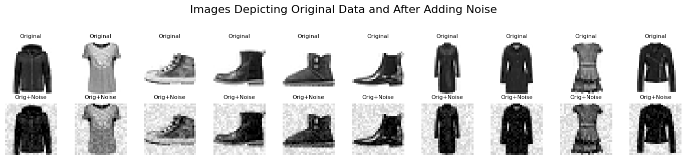
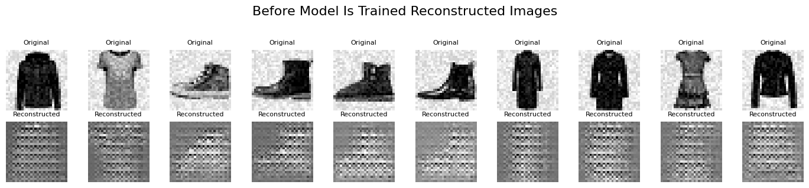
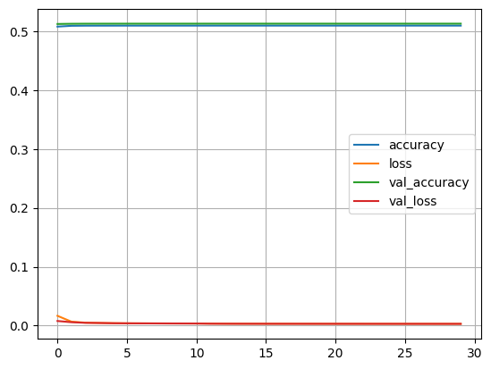
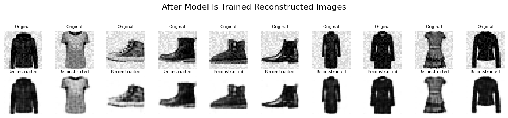
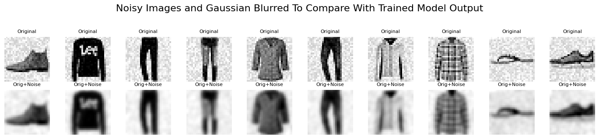
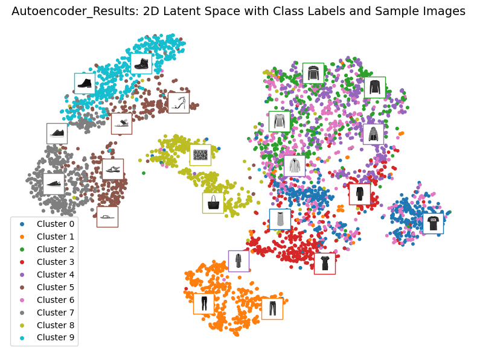

# Autoencoder Noise Removal - Fashion MNIST

A convolutional autoencoder trained to remove synthetic noise from Fashion MNIST images. This project compares
deep learning-based denoising with traditional Gaussian blur and evaluates the output using PSNR and SSIM metrics.

---

##  Project Highlights

- **Denoising Autoencoder**: Learns to map noisy images back to clean originals.
- **Evaluation**: PSNR and SSIM used for quantitative comparison.
- **Latent Space Visualization**: Explore compressed features using t-SNE.
- **Comparison**: Includes baseline using Gaussian filtering.
- **Training history & visual demos** included.

---

##  Project Structure

```bash

autoencoder-noise-removal/
    │
    ├── model.py            # DenoisingAutoEncoder class
    ├── utils.py            # Data prep, noise, plotting, t-SNE visualization
    ├── demo_script.py      # CLI-compatible demo runner
    ├── demo.ipynb          # Interactive demo with analysis
    ├── requirements.txt    # Python dependencies
    └── README.md           # This file

```
---


## Getting Started

### Requirements

```bash
 Install dependencies with:

    pip install -r requirements.txt
    
```
 ### Running the Demo:
 ```bash
     python demo_script.py
     jupyter notebook demo.ipynb
     
```
---

## Training Summary

- Average PSNR: ~25.7
  (>30 is ideal; this model performs well considering the simplicity of the network)

- Average SSIM: ~0.90
  (Closer to 1.0 indicates excellent structural preservation)

Compared to a basic Gaussian blur, the autoencoder better preserves semantic and structural content in reconstructed images.

---
###  Sample Original and Input Noisy Images 



---
### Model Reconstruction Images







---

### Gaussian Blurred Iamge



### Encoder Output/Latent Space T-SNE Viz



---

## Conclusion

This project demonstrates the effectiveness of convolutional autoencoders for image denoising tasks on Fashion MNIST.
While traditional filters like Gaussian blur smooth out noise indiscriminately (often sacrificing structure), the autoencoder
learns to selectively remove noise while preserving semantic detail and object contours.

With a relatively simple architecture, the model achieves strong PSNR and SSIM scores, showcasing the power of data-driven
feature learning in image restoration. This serves as a baseline for future work with deeper architectures, custom loss functions,
and more complex datasets.

---
