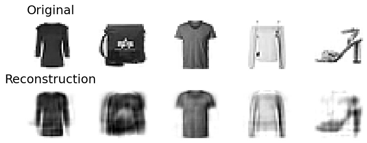
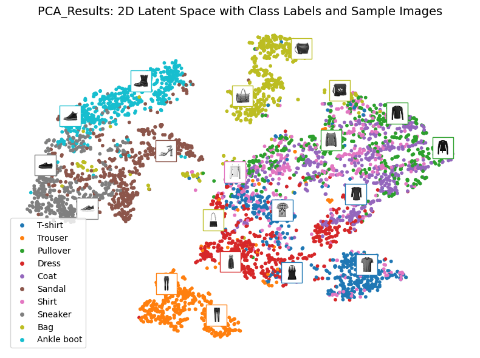
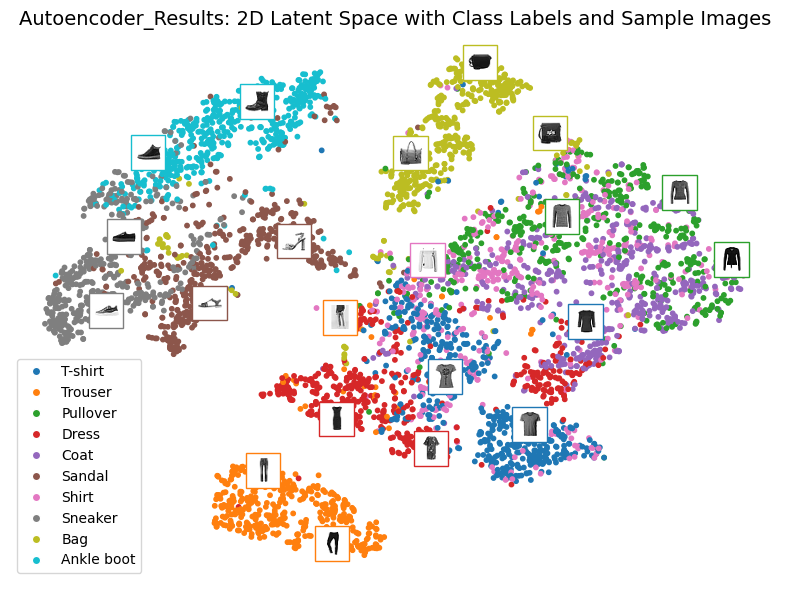
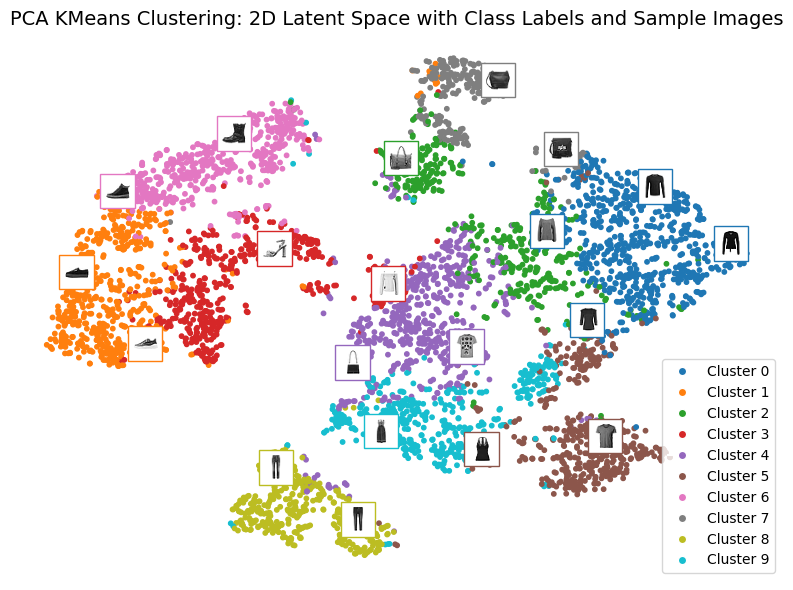
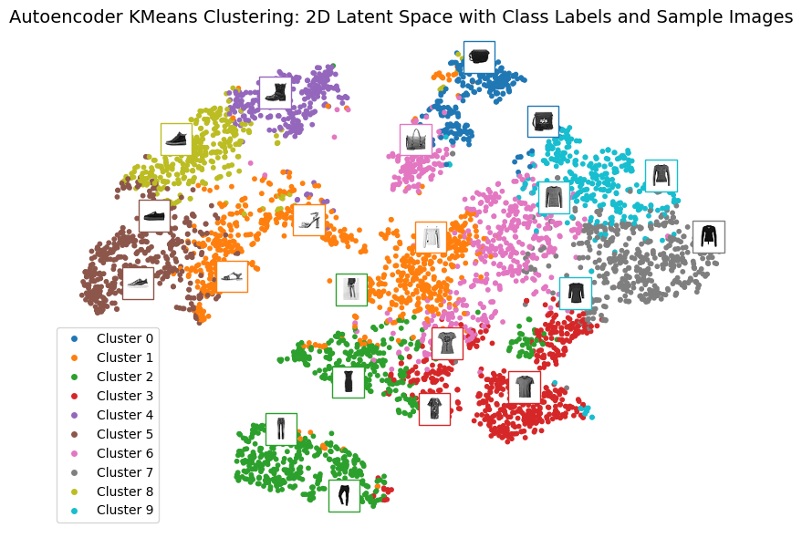

# Autoencoder vs PCA

This project compares Autoencoders and PCA as dimensionality reduction techniques on theFashion
MNIST dataset. It evaluates both methods using clustering performance (KMeans) and visualizes the
results using t-SNE and sample reconstructions.

---

## Features

- Dimensionality reduction using PCA and Autoencoders
- KMeans clustering evaluation with:
  - Adjusted Rand Index (ARI)
  - Homogeneity Score
  - Silhouette Score
- Visual inspection with t-SNE plots
- Sample reconstruction visualization

---

##  Motivation

Dimensionality reduction is essential for compression, visualization, and speeding up machine learning workflows.
This project investigates:
    
- Whether deep learning–based **autoencoders** outperform traditional **PCA**.
- How both techniques behave when followed by clustering (KMeans).
- Visualization of compressed 2D latent space via **t-SNE**.

---

##  Project Structure

```bash

autoencoder-vs-pca/
    ├── model.py            # Autoencoder model definitions
    ├── utils.py            # Visualization and evaluation utilities
    ├── demo_script.py      # Script to run the full pipeline
    ├── demo.ipynb          # Jupyter notebook version with explanations
    ├── requirements.txt    # Required packages
    └── README.md           # Project overview
    
```
---


## Getting Started

### Requirements

```bash
 Install dependencies with:

    pip install -r requirements.txt
    
```
 ### Running the Demo:
 ```bash
     python demo_script.py
     jupyter notebook demo.ipynb
     
```
---

## Training Summary

```bash

| Metric                    | Autoencoder | PCA     |
|---------------------------|-------------|---------|
| Adjusted Rand Index (ARI) | 0.336       | 0.423   |
| Homogeneity Score         | 0.489       | 0.548   |
| Silhouette Score          | 0.124       | 0.157   |

Despite being a nonlinear model, the autoencoder did not outperform PCA in this experiment. PCA remained superior for clustering structure in compressed space.
```

---
###  Sample Original and Reconstructed Images 



---
### Latent Space Representation t-SNE Viz





---
### KMean Clusters t-SNE Viz





---

## Observations

- PCA retains strong clustering properties despite being linear.
- Autoencoders may benefit from deeper tuning, more epochs, or convolutional architectures.
- **If an autoencoder uses only linear activations and the loss is MSE**, it will behave similarly to PCA — as noted in
  *Hands-On Machine Learning* (Chapter 17).

---

## Conclusion

. PCA was faster and more interpretable, and outperformed autoencoders in clustering evaluations on Fashion-MNIST.

. Autoencoders offer flexibility and nonlinearity, but need careful tuning and possibly convolutional layers to shine.

---
